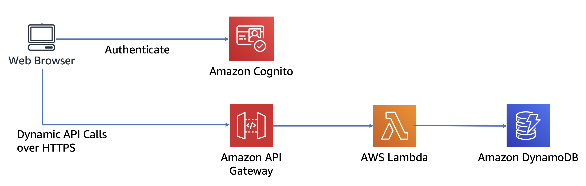

# AWS - Terraform Workshop

In this repository you will find all the things you need to understand
Terraform and how to deploy infrastructure to AWS.

## Considerations

This workshop is based on:
- Terraform **>= v1.0.4**
- AWS provider for Terraform **>= v2.0**

## Pre-requisits

### Terraform

To install Terraform cli for your system, you can follow their [official documentation](https://learn.hashicorp.com/tutorials/terraform/install-cli?in=terraform/aws-get-started)

---

## Understanding Terraform

Terraform is an open-source infrastructure as code software tool that provides a
consistent CLI workflow to manage hundreds of cloud services. Terraform codifies
cloud APIs into declarative configuration files.

### Key features

**Infrastructure as Code**

You describe your infrastructure using Terraform's high-level configuration language
in human-readable, declarative configuration files. This allows you to create a
blueprint that you can version, share, and reuse.

**Execution Plans**

Terraform generates an execution plan describing what it will do and asks for your
approval before making any infrastructure changes. This allows you to review changes
before Terraform creates, updates, or destroys infrastructure.

**Resource Graph**

Terraform builds a resource graph and creates or modifies non-dependent resources
in parallel. This allows Terraform to build resources as efficiently as possible and
gives you greater insight into your infrastructure.

**Change Automation**

Terraform can apply complex changesets to your infrastructure with minimal human
interaction. When you update configuration files, Terraform determines what changed and
creates incremental execution plans that respect dependencies.

#### How it works

Terraform uses "providers" as a plugin component that provide single units of
infrastructure called resources, like Compute Engine instances or Network configuration,
even DNS configurations or SaaS subscriptions.

Terraform keeps track of your real infrastructure in a state file, which acts as a
source of truth for your environment.

Terraform uses the state file to determine the changes to make to your infrastructure so
that it will match your configuration.

For a deeper understanding of the tool, I recommended you visit the tutorial
[Introduction to Infrastructure as Code with Terraform](https://learn.hashicorp.com/tutorials/terraform/infrastructure-as-code?in=terraform/aws-get-started)

---

## Workshop

This workshop is intended to understand a simple flow to create infrastructure as code
using Terraform CLI and AWS as the cloud provider.

We are going to deploy a serverless application with all the infrastructure components
necessary for its execution, like [AWS Lambda](https://aws.amazon.com/lambda/) as our backend layer, [Amazon API Gateway](https://aws.amazon.com/api-gateway/) to expose
our service, [Amazon Dynamo DB](https://aws.amazon.com/dynamodb/) as our data layer and [Amazon Cognito](https://aws.amazon.com/cognito/) for user administration
and authentication.

### Use case

Deploy and simple hello world API on AWS in a secure, reliable and replayed way.

### Modules

This workshop has 3 modules, each module describes a step on the path to deploying
infrastructure as code using Terraform:

| Module | Description |
|---|---|
| Provider configuration | Configure Terraform project and AWS provider with valid credentials |
| Build infrastructure | Set all the components need it to run our use case |
| Deploy infrastructure | Apply all the configuration and change some ones to play with state and outputs |

> Disclaimer: This workshop is based on the repo from Hadock using [CDKTF From zero to hero](https://github.com/hadock/CDKTF-From-Zero-To-Hero) and is authorized by him. If you are interested in CDKTF I recommend you to visit his workshop.

Happy coding ❤️